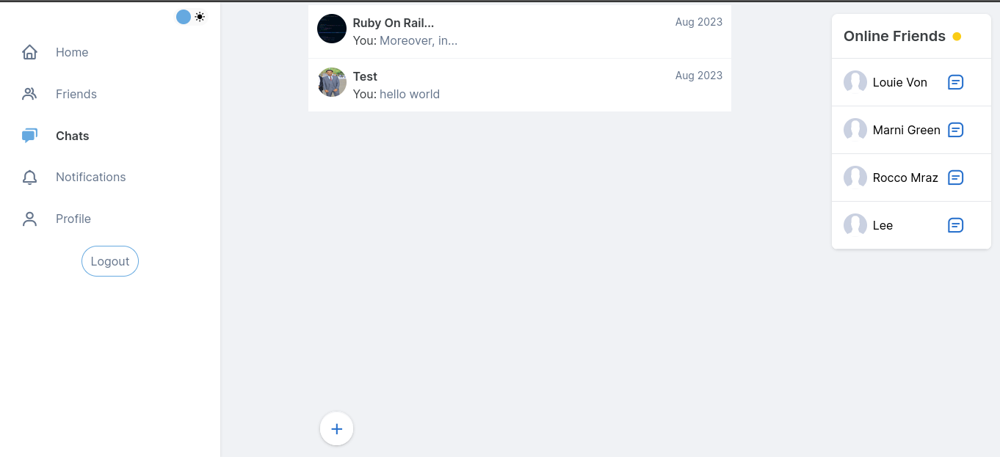

# SEFER

is mini social media buit in Ruby on Rails framework. It includes group messaging feature too.

# DEMO

[Demo Video](./screenshots/demo.webm)

## Highlights

**LOGIN**


**Home**


**Message**



**Search**


Check [screenshots](./screenshots/) for more screenshoots. It's the implementation not the prototype.


*It's responsive.*

***Ruby Version*** ```3.2.1```

## What you really need
```
Redis
Postgresql
```

## How to run?

Clone the repo

```
$ bundle install
```

**Commands to follow**

Delete credentails.yml.enc file then 

```
$ bundle exec figaro install
```
Ignore the error message. Please take a look at [config/application.copy.yml](./config/application.copy.yml) to know the environment variables that are needed. Some environment variable are not needed for development. These are 

```
GOOGLE_AUTH_CLIENT_ID
SENDGRID_API_KEY
EMAIL_ADDRESS
aws_access_key_id
aws_secret_access_key
aws_bucket_name
```

Copy [config/application.copy.yml](./config/application.copy.yml) file content to newly generated file which is [config/application.yml](./config/application.yml). Set garbage value to environment variables which are not needed for development. It would be recommended giving correct value to check all functionality in development, but if you are lazy, dont't worry set gargabe value.

Then
```
$ bin/rails credentials:edit
```

Copy the ***secret_key_base*** from it, save then close. Set the copied to ```SECRET_KEY_BASE``` in config/application.yml

Then

```
$ bin/rails db:encryption:init
```

Result looks like

```
Add this entry to the credentials of the target environment: 

active_record_encryption:
  primary_key: yYfHld8TF5BflJw22594Mlh1IqC9cgTS
  deterministic_key: Dyd6iEhVgnYwv9emD5wt4J1LbZOmtP79
  key_derivation_salt: n1CiDmxfHnCOs6Xc0wUPKNt8imgBtaK0
```

Copy the generated result then
```
$ bin/rails credentials:edit
```

Paste there, save and close. After that set those in environment variables.
```
primary_key => ACTIVE_RECORD_PRIMARY_KEY
deterministic_key => ACTIVE_RECORD_DETERMINISTIC_KEY
key_derivation_salt => ACTIVE_RECORD_KEY_DERIVATION_SALT
```

What else you have left?

```JWT_SECRET_KEY, DATABASE_URL, ``` and ```RAILS_MASTER_KEY```

For JWT_SECRET_KEY

```
$ bin/rails secret
```

Set the result in environment variable.
Set your database url

Rails will give you master key in config/ folder. If you didn't find, google how to generate new master key in Ruby on Rails.

```
$ rake db:migrate db:seed

$ bin/rails importmap stimulus-dropdown  --download

$ bin/dev

```

Make sure you are running ```redis-server``` before running rails server.
And cloud storage is still local. Change it to *s3* or whatever.
Don't forget sendgrid mailer too. If you wanna use other mailer, change the configuration.


# Missing Features

1: Person to Person(p2p) chat.

2: E2E encryption for messaging.

3: TAG for post

4: Search post by TAG

3: Search message in chat

4: Message edit by message owner

5: Message delete either by message owner or chat owner
-> don't forget pundit policy for it.

6: Chat Member list

7: Chat Member remove(leave, and remove by admin)

-> on remove by admin, it should be in blocked members list.(Model required)

8: Chat delete, and edit

9: Chat search in side bar. Do only with js. Don't load from server.

-> store in variable and filter from it.

# Weak Features

1: User recommendation in home page in desktop mode is really bad. The implemented one displays the first n users

2: Post recommendation in home page

3: User recommendation in find friends page.

Basically recommendation algorithm should be fixed.


## Where to host Rails apps?

* [Railway](https://railway.app) has free tier
* [Render](https://render.com)  has free tier
* [Fly](https://fly.io) has free tier
* [Heroku](https://heroku.com) has no free tier

## For Postgresql DB?

* [Railway](https://railway.app)
* [CockRoach](https://www.cockroachlabs.com)
* [Render](https://render.com)

## For Redis?

* [Railway](https://railway.app)

## What do you recommend?

=> I prefer Railway. It has free tier. It's free tier is so fast.

=> You don't need credit card.

This project is not sponsored by anyone btw.

# Advise

If you want to deploy in Railway, please comment all gems that are grouped under both [dev, test](./Gemfile#L42) and [test](./Gemfile#L50) and also your configuration should focus on [development environment](./config/environments/development.rb)

Make sure you set all required environment variables. If you found any issue please raise.


# Contribution

* New features
* Bug fixes
* Performance optimization
* Further Code optimization
* Adding documentation
* Fixing documentation(either typo or grammer mistake)
* Writting testings.

**Are welcome**!

# Solomon Boloshe(Lee Crey) 2023
